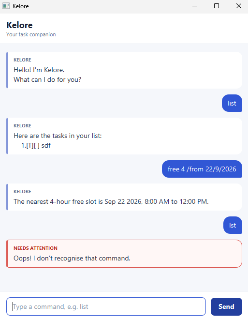

# Kelore User Guide

**Kelore** is a desktop task-tracking chatbot that helps you record tasks, track
their completion, view your schedule, search for tasks, and find free time.



## Quick start

Enter a command in the text field, then press **Enter** or select **Send**.
Kelore saves every successful change automatically, so your tasks remain
available after you restart the application.

For example, enter `todo read a book` to add a todo, then enter `list` to see
it in your task list.

## Command overview

| Purpose | Command format |
| --- | --- |
| View all tasks | `list` |
| Add a todo | `todo DESCRIPTION` |
| Add a deadline | `deadline DESCRIPTION /by DATE_TIME` |
| Add an event | `event DESCRIPTION /from START /to END` |
| Mark a task as complete | `mark NUMBER` |
| Mark a task as incomplete | `unmark NUMBER` |
| Delete a task | `delete NUMBER` |
| View dated tasks on a date | `on DATE` |
| Find tasks by description | `find KEYWORD` |
| Find the earliest free time | `free HOURS [/from DATE]` |
| End the conversation | `bye` |

Words in uppercase, such as `DESCRIPTION`, are parameters that you should
replace with your own values. Do not type the square brackets in
`[/from DATE]`; they indicate that `/from DATE` is optional.

Command words and syntax markers such as `/by`, `/from`, and `/to` are
lowercase and case-sensitive. Descriptions and search keywords may contain
uppercase letters. Dates use `d/M/yyyy`, while date-times use
`d/M/yyyy HHmm` in 24-hour time. For example, `25/9/2026 1800` means 6:00 PM
on 25 September 2026.

## Viewing tasks

Use `list` to display every saved task and its number.

Example: `list`

Task types are shown as `[T]` for todos, `[D]` for deadlines, and `[E]` for
events. A task marked `[X]` is complete, while `[ ]` means incomplete.

Use the task numbers shown by `list` with `mark`, `unmark`, and `delete`.
Results from `find` and `on` are numbered for display only, so run `list` before
updating or deleting a task if you are unsure of its task number.

## Adding todos

Use `todo DESCRIPTION` to add a task without a date or time.

Example: `todo read a book`

## Adding deadlines

Use `deadline DESCRIPTION /by DATE_TIME` to add a task with a due date and
time.

Example: `deadline submit report /by 25/9/2026 1800`

## Adding events

Use `event DESCRIPTION /from START /to END` to add an event. Both `START` and
`END` must be date-times, and the end must not be earlier than the start.
Events may span more than one day.

Example: `event project meeting /from 25/9/2026 1400 /to 25/9/2026 1600`

## Updating tasks

- `mark NUMBER` marks a task as complete.
- `unmark NUMBER` marks a task as incomplete.
- `delete NUMBER` permanently removes a task.

Examples:

- `mark 2`
- `unmark 2`
- `delete 2`

Use a positive task number that currently appears in `list`. Deleting a task
renumbers the tasks that follow it.

## Viewing tasks on a date

Use `on DATE` to display deadlines due on that date and events that occur on
that date. Todos are not included. An event that spans multiple days appears
on every date from its start date through its end date.

Example: `on 25/9/2026`

## Finding tasks

Use `find KEYWORD` to search task descriptions. Kelore first returns
descriptions containing the exact, case-sensitive text. If there are no exact
matches, it looks for individual words similar to the keyword, which can help
with small spelling mistakes.

Example: `find report`

## Finding free times

Use `free HOURS` to find the earliest uninterrupted free slot of the requested
number of whole hours. Kelore searches every calendar day, including weekends,
between 8:00 AM and 6:00 PM.

Only incomplete events occupy time. Todos, deadlines, completed events, and
events whose start and end times are identical do not occupy time.

The search begins at the current time when considering today. Add
`/from DATE` to begin on a specified date that is today or later; a specified
future date is searched from 8:00 AM.

Examples:

- `free 4`
- `free 2 /from 25/9/2026`

Kelore returns the earliest slot with exactly the requested duration:

```text
The nearest 4-hour free slot is Sep 22 2026, 9:00 AM to 1:00 PM.
```

`HOURS` must be a whole number from 1 to 10. A `/from` date cannot be earlier
than today and must use the `d/M/yyyy` format.

## Exiting Kelore

Use `bye` to end the conversation. Kelore disables further command entry for
that session. Restart the application to begin a new session.
